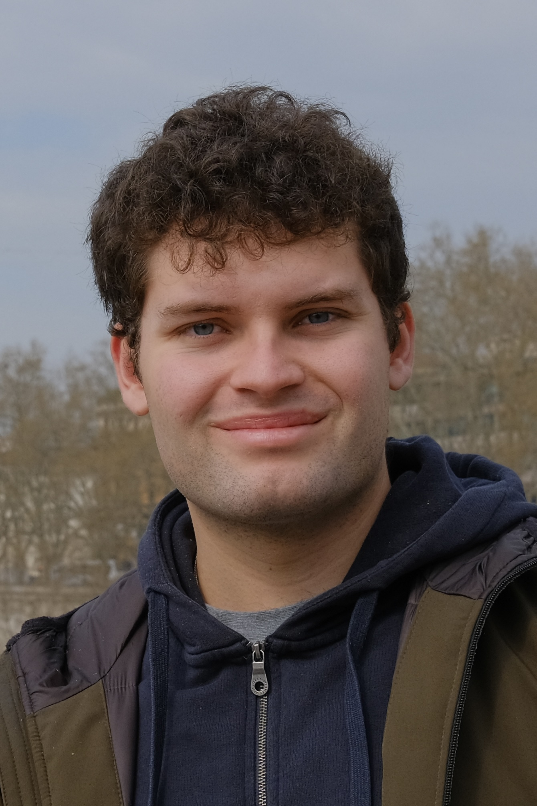

::: {.columns .profile-layout}

::: {.column width="25%"}
{.profile-img}
:::

::: {.column width="75%"}

PhD Candidate · Economics &amp; Finance

## Welcome
My name is Matteo del Piano and I am a 2nd year PhD student in Economics and Finance at Free University of Bolzano and Unviersity of Trento.

In this website you can find more about my ongoing research and interests!
:::

:::

:::{.jmp-banner .affiliation-banner}

Affiliation

Free University of Bozen-Bolzano · University of Trento

 

**Visiting PhD Student**

Universidad Carlos III de Madrid

(Oct 2026 – Apr 2027)

:::

::: {.info-grid}
::: {.info-card}

Curriculum Vitae

[Download latest CV version ->](doc/Matteo_CV.pdf){.btn-accent}
:::

::: {.info-card}

Research focus

Mobility differentials across migrant generations, and enforcement policy effects on ethnic enclaves.
:::
:::

:::{.jmp-banner}

Job market paper

**The impact of Secure Communities on ethnic enclaves in United States communities**

Work in progress

:::

::: {.contact-links}
[Email](mailto:matteodelpiano@yahoo.com)
[LinkedIn](https://www.linkedin.com/in/matteodelpiano/)
[X](https://x.com/matteodelpiano)
[Substack](https://substack.com/@matteodelpiano1999)
:::
