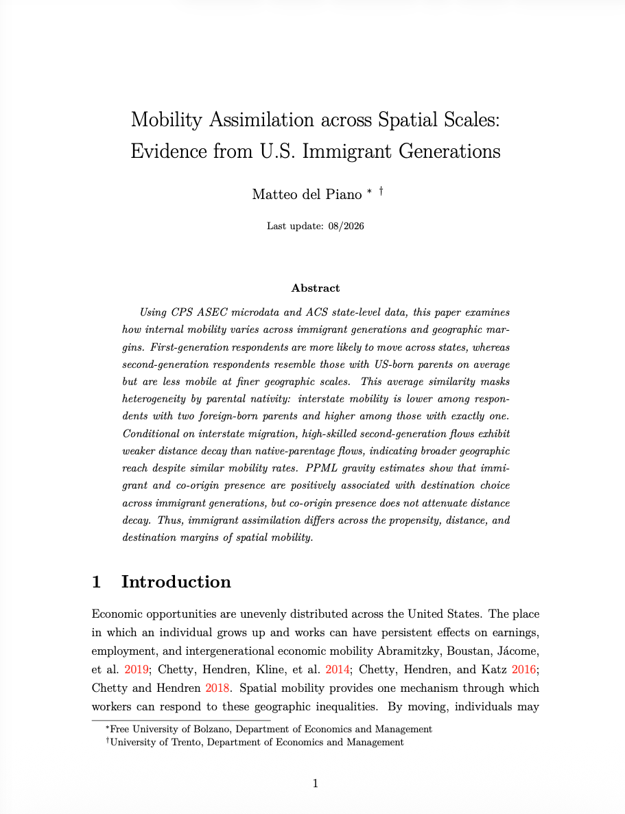

## Working papers

::: {.paper-row}
{.paper-thumb}

Working paper

### Mobility Assimilation across Spatial Scales: Evidence from U.S. Immigrant Generations

Using CPS ASEC microdata and ACS state-level data, this paper examines how internal mobility varies across immigrant generations and geographic margins. First-generation respondents are more likely to move across states, whereas second-generation respondents resemble those with US-born parents on average but are less mobile at finer geographic scales. 
This average similarity masks heterogeneity by parental nativity: interstate mobility is lower among respondents with two foreign-born parents and higher among those with exactly one.
Conditional on interstate migration, high-skilled second-generation flows exhibit weaker distance decay than native-parentage flows, indicating broader geographic reach despite similar mobility rates. 
PPML gravity estimates show that immigrant and co-origin presence are positively associated with destination choice across immigrant generations, but co-origin presence does not attenuate distance decay. 
Thus, immigrant assimilation differs across the propensity, distance, and destination margins of spatial mobility.

::: {.paper-actions}
[Working paper](papers/WP_1stvs2nd_generation.pdf){.btn-outline}
:::

:::

::: {.paper-row}

Work in progress

### Enforcement law and ethnic enclaves: the impact of Secure Communities on local demographic composition

:::
