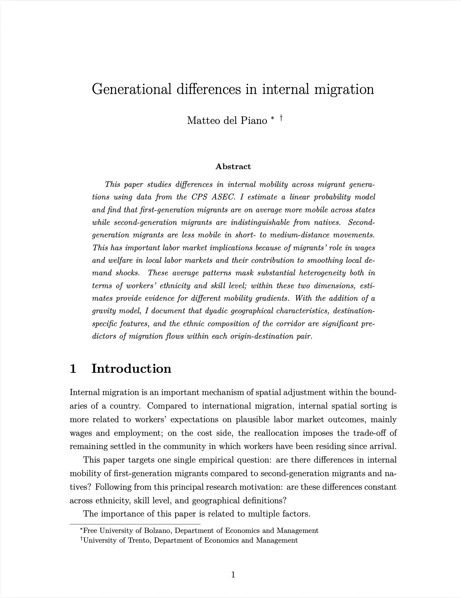

## Working papers

::: {.paper-row}
{.paper-thumb}

Working paper

### Generational difference in internal migration

This paper studies differences in internal mobility across migrant generations using data from the CPS ASEC. I estimate a linear probability model and find that first-generation migrants are on average more mobile across states while second-generation migrants are indistinguishable from natives. Second-generation migrants are less mobile in short- to medium-distance movements. This has important labor market implications because of migrants' role in wages and welfare in local labor markets and their contribution to smoothing local demand shocks. These average patterns mask substantial heterogeneity both in terms of workers' ethnicity and skill level; within these two dimensions, estimates provide evidence for different mobility gradients. With the addition of a gravity model, I document that dyadic geographical characteristics, destination specific features, and the ethnic composition of the corridor are significant predictors of migration flows within each origin-destination pair.

::: {.paper-actions}
[Working paper](papers/WP_1st_vs_2nd_generation.pdf){.btn-outline}
:::

:::

::: {.paper-row}

Work in progress

### Enforcement law and ethnic enclaves: the impact of Secure Communities on local demographic composition

:::
